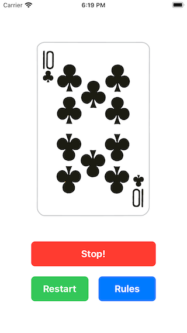
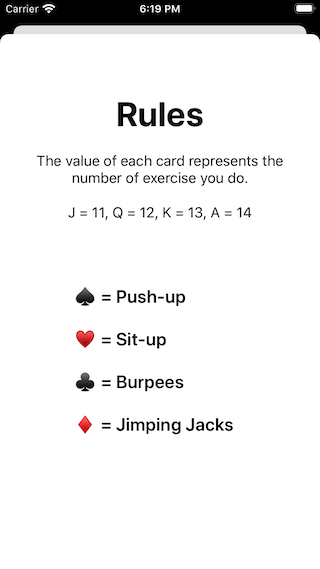
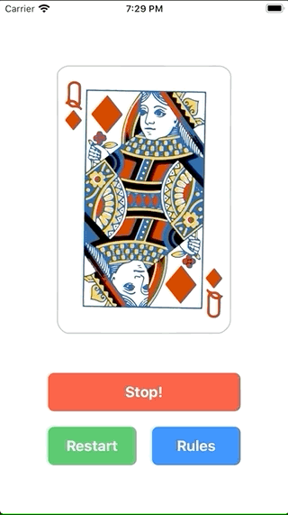

# Card Workout (UIKit)

## Description

Don't you know what to do? well, let the cards to decide for you!

### Notes

If you are looking for the logic to get the cards from your assets using a loop function instead the static you can copy the gist from here

[Gist: Get All The Cards from Assets](https://gist.github.com/fdorado985/c4615ea211467360d2a24bdb08a347a6)

## Tags

Through these tags you can navigate through each section developed on the app.

### [user-interface](https://github.com/fdorado985/CardWorkout/tree/user-interface)

| Screenshot 01 |
| ------------- |
|  |

### [outlets-actions-and-rules-screen](https://github.com/fdorado985/CardWorkout/tree/outlets-actions-and-rules-screen)

| Screenshot 02a | Screenshot 02b |
| -------------- | -------------- |
|  |  |

### [timers-cards-and-logic](https://github.com/fdorado985/CardWorkout/tree/timers-cards-and-logic)

| Screenshot 03 |
| ------------- |
|  |
